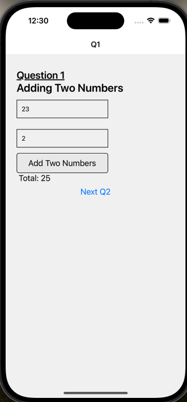
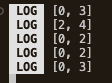

# Getting Started

3 Question has split into 3 screen.
Remember to

```bash
# using npm
yarn install

# ios
cd ios
pod install
yarn ios

# android
yarn android
```

## Question 1



## Question 2

https://github.com/jun0187/CodingQuestion/assets/110581048/80a75665-1183-417d-b4ac-de4ee2cea4fd


## Question 3

#### Question: -

[4, 11, 17, 25], 21
[0, 1, 2, 2, 3, 5], 4
[-1, 0], -1
[2, 7, 11, 15], 9
[2, 3, 4], 6

#### Answer from console: -


